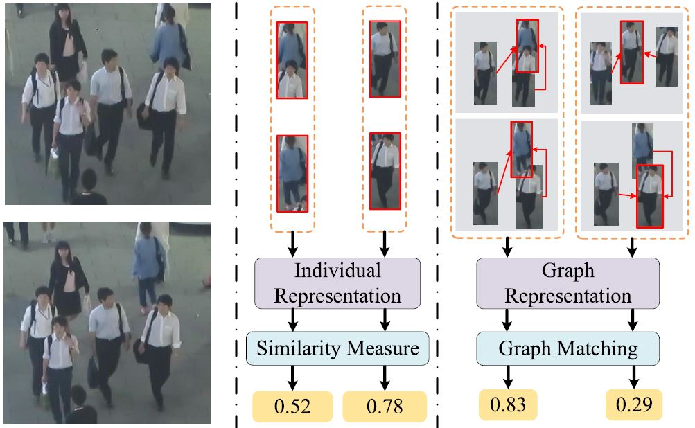

## MOT-GCN
This is the repo. for our paper `GSM: Graph Similarity Model for Multi-object Tracking` in IJCAI 2020.



The popular tracking-by-detection paradigm for multi-object tracking (MOT) focuses on solving data association problem, of which a robust similarity model lies in the heart. Most previous works make effort to improve feature representation for individual object while leaving the relations among objects less explored, which may be problematic in some complex scenarios. In this paper, we focus on leveraging the relations among objects to improve robustness of the similarity model. To this end, we propose a novel graph representation that takes both the feature of individual object and the relations among objects into consideration. Besides, a graph matching module is specially designed for the proposed graph representation to alleviate the impact of unreliable relations. With the help of the graph representation and the graph matching module, the proposed graph similarity model, named GSM, is more robust to the occlusion and the targets sharing similar appearance.


## Install

```
pip install -r requirements.txt
cd lib
sh make.sh
```

## Dependence
- We use the detector in [Tracktor](https://github.com/phil-bergmann/tracking_wo_bnw) to modify the public provided detections. We try our best to do the same refinement as Tracktor. If you want a high tracking performance, please use the provied detector.

- Our tracker is simple without the alignment between two frames. Instead we use optical flow as the motion of objects to `align` objects between two frames. Note that the usage of optical flow is `optional`. If you want to use it, please extract the optical flow with [FlowNet](https://github.com/NVIDIA/flownet2-pytorch) and store the extracted flow in the disk (ref. the following  Data).


## Data
We use MOT16 and MOT17 to train and evaluate our model. 
- download the data and labels from [MOTChallenge](https://motchallenge.net/)
- modify the data path in the file `${GSM_ROOT}/lib/datasets/mot_info.py`

The structure of prepared dada should be:
```
${some_where}
      |------ MOT16
      |         |----- train
      |         |        |--- MOT16-02
      |         |        |       |--- gt
      |         |        |       |     |--- gt.txt
      |         |        |       |--- det
      |         |        |       |     |--- det.txt
      |         |        |       |--- img1
      |         |        |       |     |--- 000001.jpg
      |         |        |       |     |--- ...
      |         |        |       |--- flow
      |         |        |       |     |--- forward
      |         |        |       |     |       |--- 000001.flo
      |         |        |       |     |       |--- ...
      |         |        |--- ...
      |         |----- test
```

## Experiments

### Preparation

Download pretrained models use this [link](https://mailustceducn-my.sharepoint.com/:f:/g/personal/liuqk3_mail_ustc_edu_cn/EtNkb_HeHalLtI6tiEiIskIBnf2SX3X-VdTWOgNkc08JQw?e=eQMxyb). All models and files need to be downloaded and put to `${GSM_ROOT}/model_weight`.

### Test
Just run:
```
python eval_mot.py
```
The configuration of tracker is the file `${GSM_ROOT}/tracker_config.py`, in which you can try different cofigurations. The default mybe a little difference with that used for our paper, which has a negligible impact on the final tracking results.

The results will be saved in `${GSM_ROOT}/track_results`.

### Train
To get different models, you can change the configuration in `${GSM_ROOT}/lib/models/config/config.py`. The configuration for backbone, graph similarity model, dataloader are all included.

The configuration can also be given by a json file, please refer to `${GSM_ROOT}/experiments/train_graph_similarity.sh`.

Once the file is configured correctly, you can run:
```
sh experiments/train_graph_similarity.sh
```
If the training process is conducted for the first time, some files will be cached in `${GSM_ROOT}/data_cache` for a faster training.
The model and logs will be saved in `${GSM_ROOT}/logs`.

## Cite
```
@book{ijcai2020gsm,
  title={GSM: Graph Similarity Model for Multi-object Tracking},
  author={Qiankun Liu, Qi Chu, Bin Liu and Nenghai Yu},
  booktitle={International Joint Conferences on Artificial Intelligence Organization}
  year={2020},
  volume={7},
}
```
Note: there is a little error in Google scholar about our paper, because the title of the paper is renamed to `Graph Similarity Model for Multi-object Tracking`.